<h2 align="center">A Cross-Platform IPTV Player and Home Media Server</h2>

[](https://github.com/mondesirm/mediaplex/blob/main/LICENSE)
<!-- [](https://github.com/mondesirm/mediaplex/actions?query=workflow:deploy) -->

A cross-platform **IPTV player** and **Home Media Server** developed for Web/Android/IOS/Windows.

<div>✔️ Browse through the channels by category or country.</div>
<div>✔️ Over 28 categories and 138 countries to choose from.</div>
<div>✔️ Watch channels from and add them to your favorites.</div>
<div>✔️ Consult your recent activity from your watch history.</div>

## **Overview**📺

The app uses the [IPTV API](https://github.com/iptv-org/api) as a data sources and uses the standard dart libraries for making network requests.

In terms of UI, the goal was replicating the Android design as closely as possible to understand the possibilities that Flutter offers for crafting UIs.

## **Screenshots**
### Authentication
Login|Register
---|---
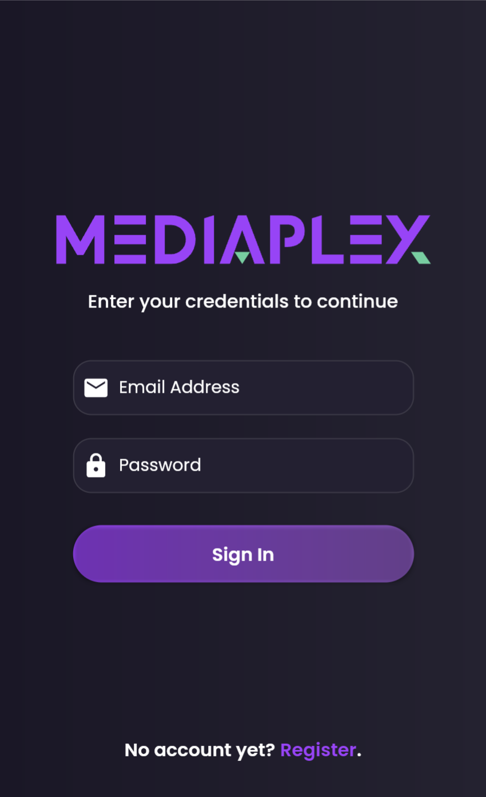|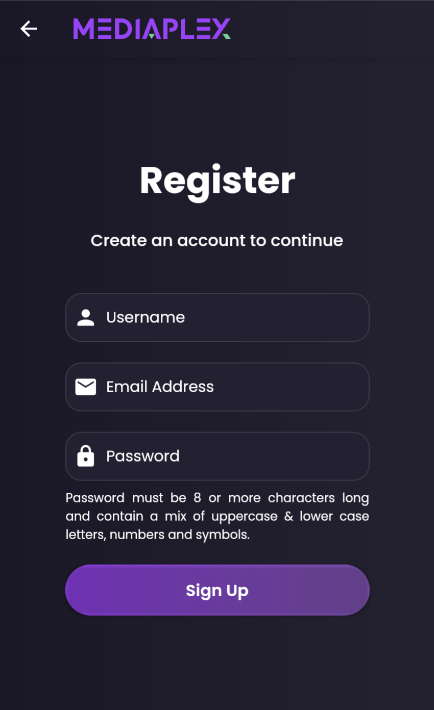

### Home
Portrait|Landscape
---|---
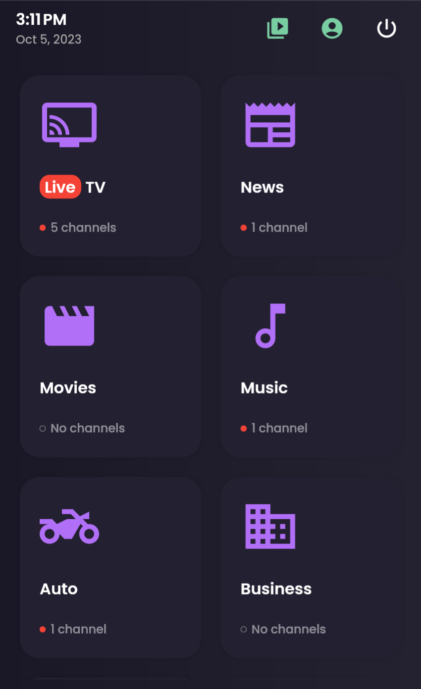
|

### Countries
Portrait|Landscape
---|---
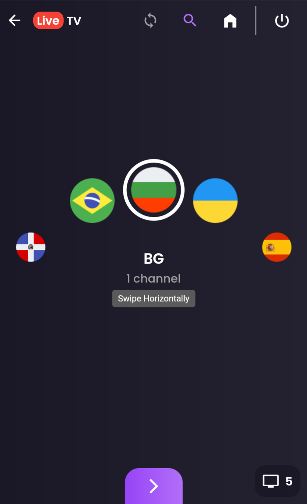|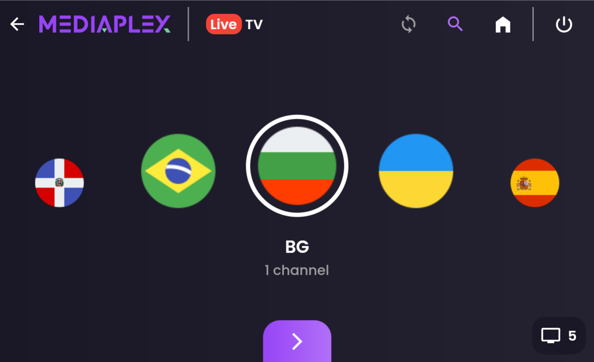

### Channels
Portrait|Landscape
---|---
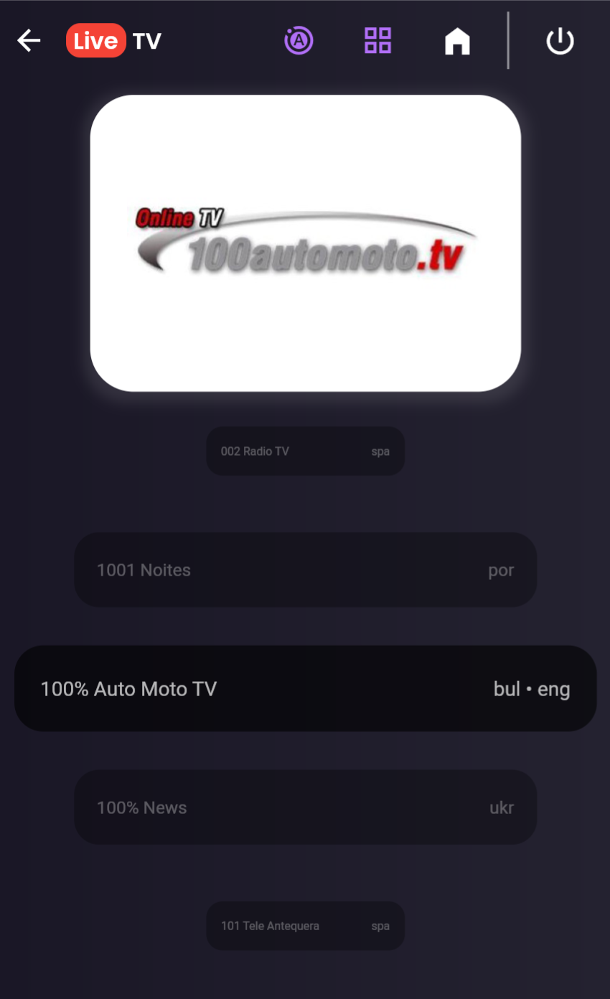|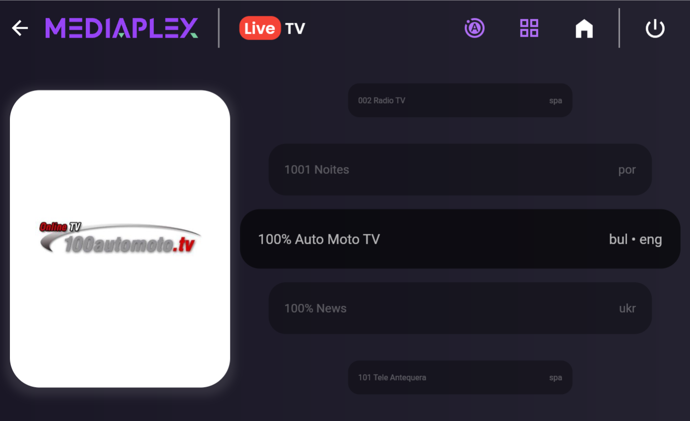

### Library
History|Favorites|Files
---|---|---
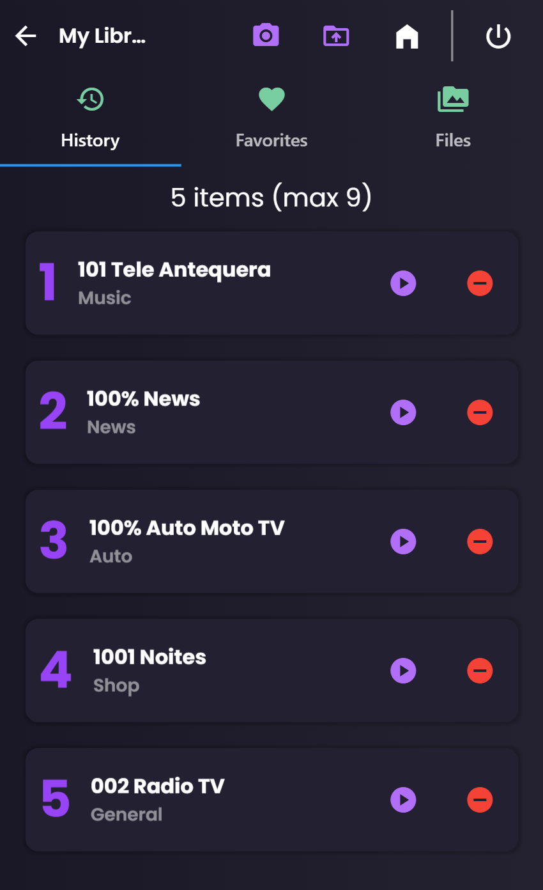|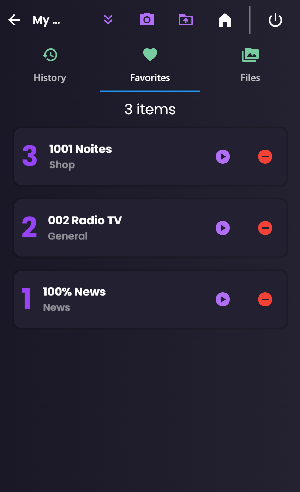|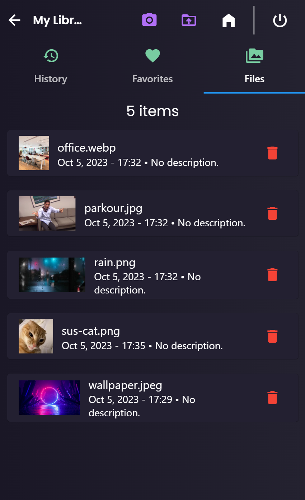

### Media
Preview|Gallery|Player
---|---|---
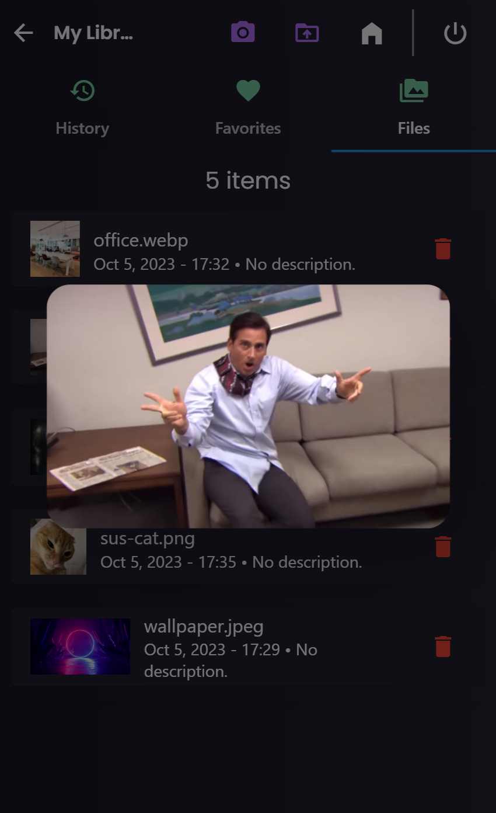|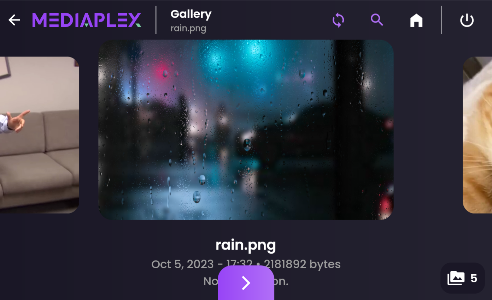|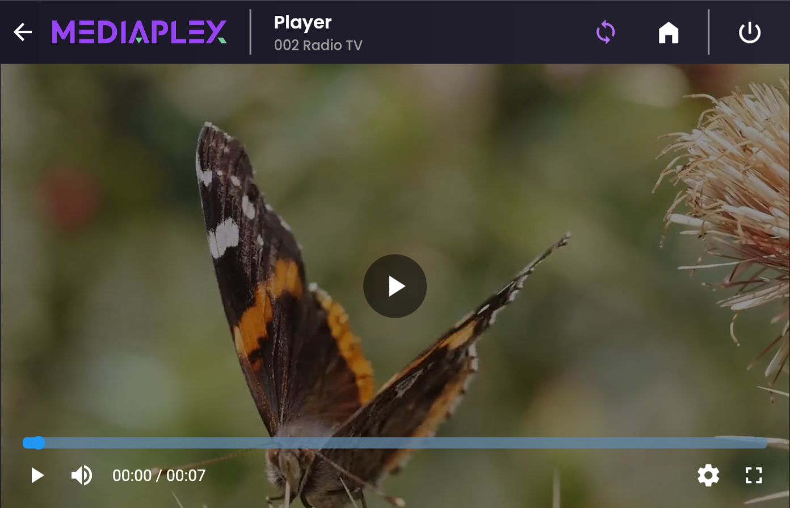

### Account
Profile|Settings
---|---
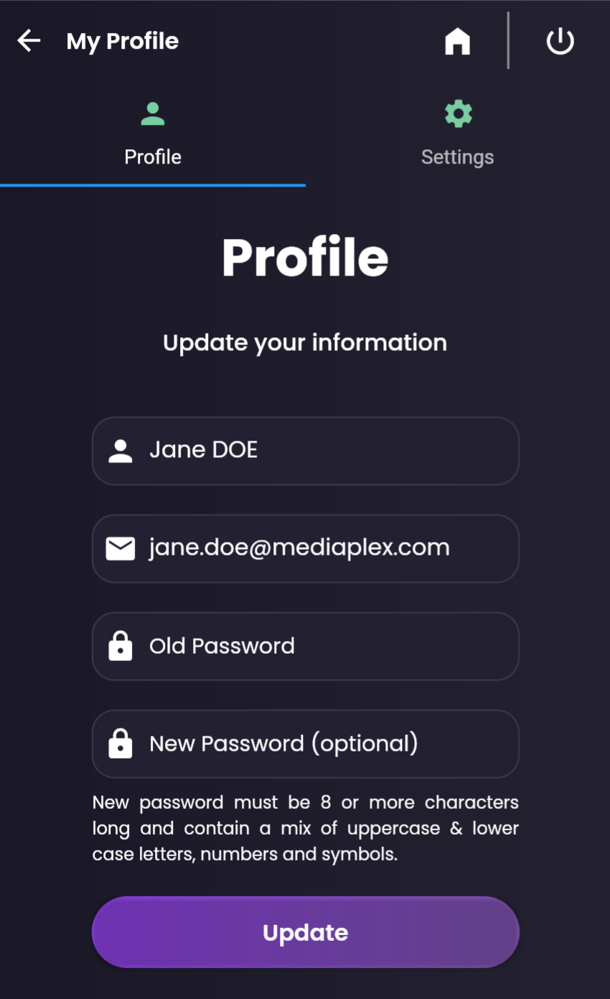|

## **Requirements**
- Any Operating System (i.e. MacOS X, Linux, Window)
- Any IDE with Flutter SDK installed (i.e. IntelliJ, Android Studio, VSCode etc)
- Knowledge about Dart and Flutter

## **Features**

- [x] Login
- [x] Register
- [x] View Live Stream
- [x] Add to Favorites
- [x] Sort by Country

## **API Reference**

> API used : https://iptv-org.github.io

#### Get all channels

```
  GET /iptv/channels.json
```

| Parameter | Type   | Response           |
| --------- | ------ | ------------------ |
| `none`    | `none` | `List of Channels` |

## **Backend**

Backend was developed using fast API and Sqlite

> API used : https://web-7-ush.cloud.okteto.net

Check following repository to know more about [**Teve-Backend**](https://github.com/7-USH/Teve-Backend).

## **Credits**
- [IPTV API](https://github.com/iptv-org/api)
- [IPTVify App Ui Design](https://dribbble.com/shots/14754204-IPTVify-App-Ui-Design)